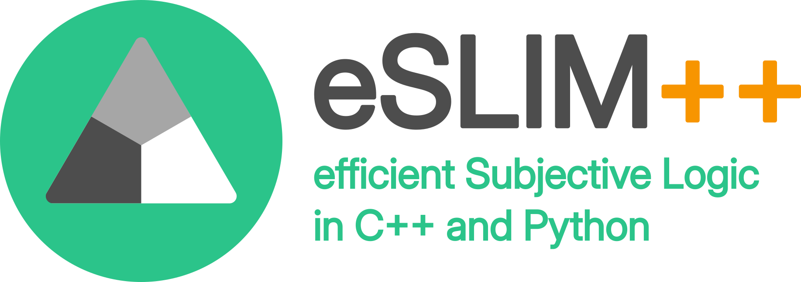

# For the Reviewers
To run the evaluation scripts reproducing the paper presentations, please refer to the following install/use instructions for [Python](publications/README.md) and [C++](publications/eSLIM++/README.md)\
For general use, please follow the instructions below.



# eSLIM++ - efficient Subjective Logic IMplementation in C++
eSLIM++ is intended to provide fast subjective logic calculus that can be embedded into high-performance applications.
For this reason, it was developed in C++, and its core functionality is compatible with CUDA.
Nevertheless, to provide user-friendly access, Python bindings are provided, too.

Generally, eSLIM++ is developed to be used within the aduulm (Autonomous Driving @ Ulm University) framework at the Institut for Measurement-, Control-, and Microtechnology.
Thus, some references, e.g., facilitating cmake macros, are contained, but should not hinder any use outside aduulm.
Further, it can be built using standalone CMake or, if used within a ROS2 stack, using colon. A more detailed description and instructions for installation are below.


# Installation
eSLIM++ is available as a Python package with Pypi and, for Python usage, can easily be installed with:
```bash
  pip install eslimpp
```
After installation, eSLIM++ provides an importable Python package called `subjective_logic`.
(May change to eslimpp in the future)

For using the C++ interface, the repository can be cloned and built using cmake, e.g.,
```bash
  git clone [link to repo]
  cd eslimpp
  mkdir build
  cd build
  cmake ..
  # header-only build should be fairly fast; no multi-thread necessary
  make install
```

If the Python bindings should be built for testing or similar, simply create a build directory in `library/src/bindings` and proceed similarly.
Here, some dependencies might be required, such as `nanobind`, and potentially, install paths must explicitly be defined.
Alternatively, the Python package can be built from source using `pip`
For this, run `pip` in the root directly
```bash
  pip install [-e] .
```

The library can also be packaged for Pypi or similar, for this refer to the [description](building_package.md), which serves as a small reminder.

When there are no changes in C++ or the bindings made by the user, it is recommended to install the Python package using pip.


### Dependencies and Requirements for Installation
To build eSLIM++, the minimum required `cmake` version is `3.16`.
If the python package was not already built for your system, `cmake` is required during the `pip` installation
Further, `Python 3.8` is required during the build process, running an existing build on older Python version has not been tested.


## Uninstallation
To remove eslimpp from your system, simply uninstall the pip package.
Or, in the case of C++, run the following in the build directory
```bash
  make uninstall
```

# Documentation
eSLIM++ provides doxygen and sphinx documentation, which currently contains the docstrings from the source code.
More sophisticated and detailed documentation is in progress, adding figures and latex-formated equations, etc.
Information about how to build the documentation is available [here](docs/README.md).

# Reproducable Publication Results
One of the core ideas behind eSLIM++ is to provide reproducible results of recent research results.
For this, the `publication` directory includes reference implementations to obtain results from certain publications.\
As of now (time of publication), only the two most recent submissions to the MfI are included to demonstrate the easy-to-use Python access and high-performance C++ application.
However, everyone using eSLIM++ is welcome to contribute their own implementations for upcoming publications.\
Instructions on how to run Python examples are provided [here](publications/README.md).
If C++ implementations are available, a detailed description on how to run them should be available for each example separately, as, depending on the use case, the prerequisites may differ greatly.

# References
Most of the functions and operations of eSLIM++ have been published by various authors.
The list below is meant to provide an overview of works which introduce the functionality that is available within this library.
The numbers are references within the code at several points, and the list is subject to change.

<a id="1">[1]</a>
Jøsang, A. (2016). Subjective Logic: A Formalism for Reasoning Under Uncertainty. Springer International Publishing.\
<a id="2">[2]</a>
Jøsang, A., Zhang, J., & Wang, D. (2017). Multi-source trust revision. International Conference on Information Fusion (Fusion).\
<a id="3">[3]</a>
van der Heijden, R. W., Kopp, H., & Kargl, F. (2018). Multi-Source Fusion Operations in Subjective Logic. International Conference on Information Fusion (FUSION).\
<a id="4">[4]</a>
Wodtko, T., Griebel, T., Scheible, A., & Buchholz, M. (2024). Conflict Handling in Time-Dependent Subjective Networks. 27th International Conference on Information Fusion (FUSION).\
<a id="5">[5]</a>
Kaplan, L., Şensoy, M., Chakraborty, S., & de Mel, G. (2015). Partial observable update for subjective logic and its application for trust estimation. Information Fusion, 26, 66–83.\
<a id="6">[6]</a>
Scheible, A., Griebel, T., Herrmann, M., Hermann, C., & Buchholz, M. (2023). Track Classification for Random Finite Set Based Multi-Sensor Multi-Object Tracking. IEEE Symposium Sensor Data Fusion and International Conference on Multisensor Fusion and Integration (SDF-MFI).\
<a id="7">[7]</a>
Josang, A., Cho, J.-H., & Chen, F. (2018). Uncertainty Characteristics of Subjective Opinions. 21st International Conference on Information Fusion (FUSION).

# Applications
At the time of publication, eSLIM++ was already used internally (addulm) to solve modern research questions.
Partly, the library was directly used during the evaluation of these works, partly, works have been implemented using eSLIM++ after the publication.
The list below should give the reader an impression of possible applications of eSLIM++ and, at the same time, may also provide some food for thought.

<a id="101">[1]</a>
Wodtko, T., Griebel, T., Scheible, A., & Buchholz, M. (2024). Conflict Handling in Time-Dependent Subjective Networks. 27th International Conference on Information Fusion (FUSION).\
<a id="102">[2]</a>
Schumann, O., Wodtko, T., Buchholz, M., & Dietmayer, K. (2024). Self-Assessment of Evidential Grid Map Fusion for Robust Motion Planning. IEEE International Conference on Intelligent Transportation Systems (ITSC).\
<a id="103">[3]</a>
Scheible, A., Griebel, T., Herrmann, M., Hermann, C., & Buchholz, M. (2023). Track Classification for Random Finite Set Based Multi-Sensor Multi-Object Tracking. IEEE Symposium Sensor Data Fusion and International Conference on Multisensor Fusion and Integration (SDF-MFI).\
<a id="104">[4]</a>
Scheible, A., Griebel, T., & Buchholz, M. (2024, September 24). Self-Monitored Detection Probability Estimation for the Labeled Multi-Bernoulli Filter. IEEE 27th International Conference on Intelligent Transportation Systems (ITSC).


# Licence - Apache 2.0
The library is meant to be widely used in various applications; respectively, the licence was choosen.
Community driven updates are highly welcomed, if doing so, please be aware of this licence, further details will follow (signing MR commits to accept license and copyright etc.)


# Acompaning publication
Introducing this library, there is currently a paper under review at the IEEE International Conference on Multisensor Fusion and Integration.
The reviewers are highly welcome to check out the code and run the example scripts producing the results presented in this work.
Details of the publication will follow, if applicable.

# Citation
I would be delighted if eSLIM++ were used in other projects that might get published at some point.
In this case, please cite the library with its introduction paper.
A citation description will be available upon publication.

